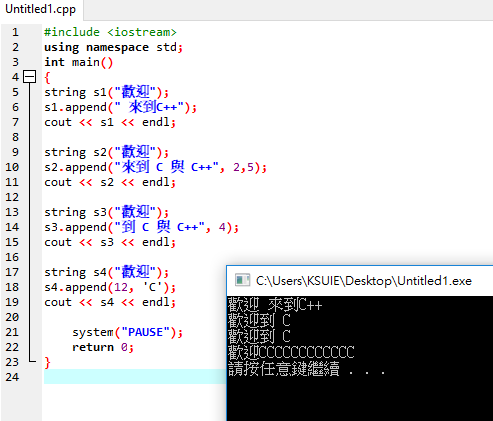

# C++ 的 string 類別

### 字串的附加
```
#include <iostream>
using namespace std;
int main()
{
string s1("Welcome");
s1.append(" to CPP"); 
cout << s1 << endl; 
```
```
string s2("Welcome");
s2.append(" to C and Cpp", 3, 6); 
cout << s2 << endl;
```
```
string s3("Welcome");
s3.append(" to C and Cpp", 7); 
cout << s3 << endl; 
```
```
string s4("Welcome"); 
s4.append(14, 'F'); 
cout << s4 << endl;  
 
    system("PAUSE");
    return 0;
}
```


--------------------------------------------------------------
