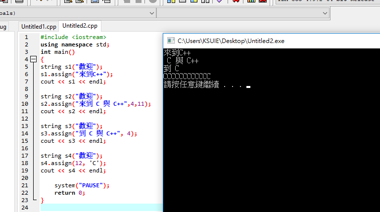
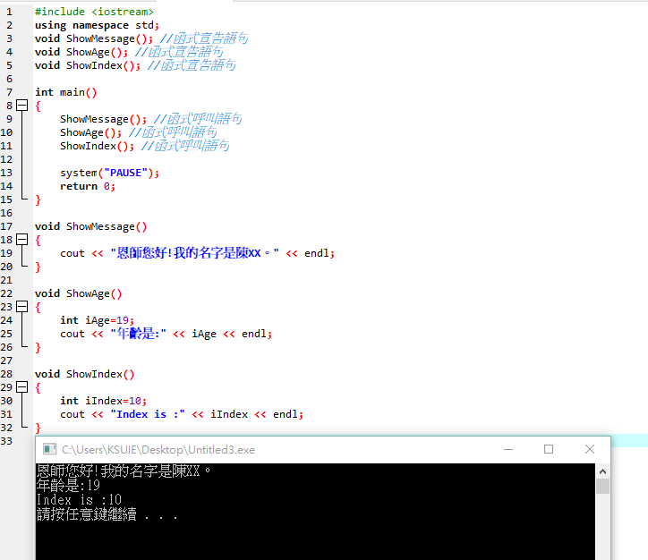
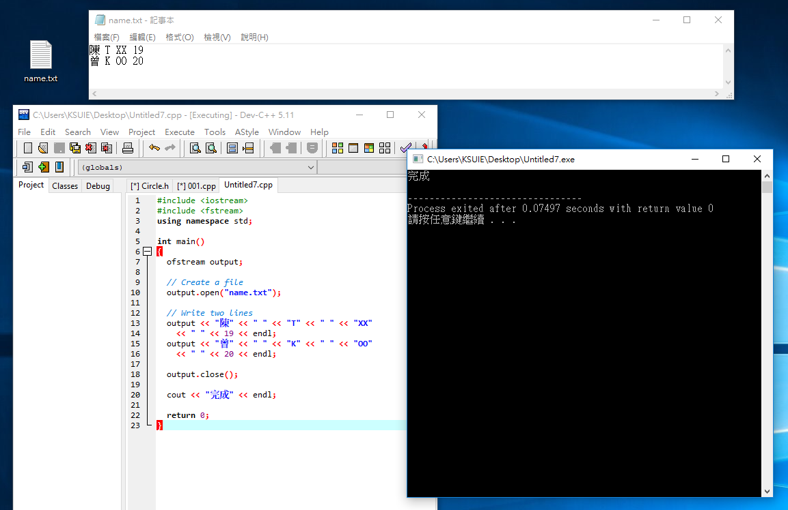
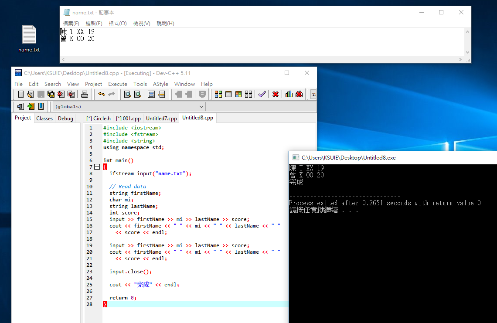

# C++ 的 string 類別

### 字串的附加
```
#include <iostream>
using namespace std;
int main()
{
```
```
string s1("歡迎");
s1.append(" 來到C++"); 
cout << s1 << endl; 
```
```
string s2("歡迎");
s2.append("來到 C 與 C++", 2,5); 
cout << s2 << endl;
```
```
string s3("歡迎");
s3.append("到 C 與 C++", 4); 
cout << s3 << endl; 
```
```
string s4("歡迎"); 
s4.append(12, 'C'); 
cout << s4 << endl;  
 ```
 ```
    system("PAUSE");
    return 0;
}
```


--------------------------------------------------------------
### 字串的指定
```
#include <iostream>
using namespace std;
int main()
{
```
```
string s1("歡迎");
s1.assign("來到C++"); 
cout << s1 << endl; 
```
```
string s2("歡迎");
s2.assign("來到 C 與 C++",4,11); 
cout << s2 << endl;
```
```
string s3("歡迎");
s3.assign("到 C 與 C++", 4); 
cout << s3 << endl; 
```
```
string s4("歡迎"); 
s4.assign(12, 'C'); 
cout << s4 << endl;  
 ```
 ```
    system("PAUSE");
    return 0;
}
```




--------------------------------------------------------------
### 字串的呼叫
```
#include <iostream>
using namespace std;
void ShowMessage(); //函式宣告語句
void ShowAge(); //函式宣告語句
void ShowIndex(); //函式宣告語句

int main()
{
	ShowMessage(); //函式呼叫語句
	ShowAge(); //函式呼叫語句
	ShowIndex(); //函式呼叫語句
	
    system("PAUSE");
    return 0;
}

void ShowMessage()
{
	cout << "恩師您好!我的名字是陳XX。" << endl;
}

void ShowAge()
{
	int iAge=19;
	cout << "年齡是:" << iAge << endl;
}

void ShowIndex()
{
	int iIndex=10;
	cout << "Index is :" << iIndex << endl;
}

```




--------------------------------------------------------------
# 檔案的輸入與輸出
### 輸入
```
#include <iostream>
#include <fstream>
using namespace std;

int main()
{
  ofstream output;

  // Create a file
  output.open("name.txt");

  // Write two lines
  output << "陳" << " " << "T" << " " << "XX" 
    << " " << 19 << endl;
  output << "曾" << " " << "K" << " " << "OO" 
    << " " << 20 << endl;

  output.close();

  cout << "完成" << endl;

  return 0;
}
```


--------------------------------------------------------------
### 輸出
```
#include <iostream>
#include <fstream>
#include <string>
using namespace std;

int main()
{
  ifstream input("name.txt");

  // Read data
  string firstName;
  char mi;
  string lastName;
  int score;
  input >> firstName >> mi >> lastName >> score;
  cout << firstName << " " << mi << " " << lastName << " "
    << score << endl;

  input >> firstName >> mi >> lastName >> score;
  cout << firstName << " " << mi << " " << lastName << " "
    << score << endl;

  input.close();

  cout << "完成" << endl;

  return 0;
}
```

