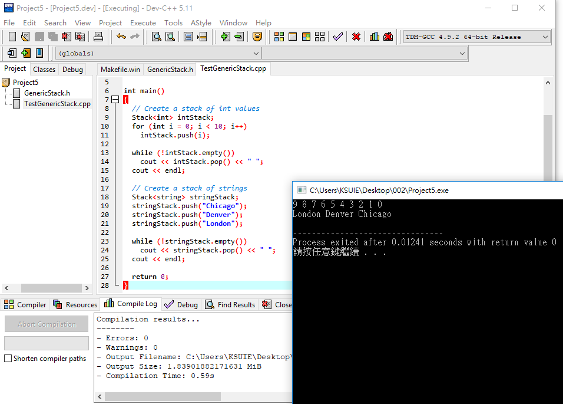

### 整數類型的stack

>* [1]定義 ==> StackOfIntegers.h
>* [2]實作==> StackOfIntegers.cpp
>* [3]使用==> TestStackOfIntegers.cpp

[1]定義 ==> StackOfIntegers.h
```
#ifndef STACK_H
#define STACK_H

class StackOfIntegers  //類別名稱
{
public:  //公開的::可以被存取
  StackOfIntegers();//建構子
  bool isEmpty() const;//()測試是否為空的函數
  int peek() const;//取出最上面元素的函數
  void push(int value);//把資料丟入的函數
  int pop();//取出最上層資料的函數
  int getSize() const;//取得堆疊的大小的函數

private://私有的 1.把資料隱藏起來 2.使用上述的公開函數來存取
  int elements[100];//整數類型的元素 大小為一百
  int size;//整數類型的大小
};

#endif
```

[2]實作==> StackOfIntegers.cpp
```
#include "StackOfIntegers.h"

StackOfIntegers::StackOfIntegers()//類別的建構子的實作
{
  size = 0;//產生大小為零的StackOfIntegers物件
}

bool StackOfIntegers::isEmpty() const //測試是否為空的實作
{//此函數執行後回傳的值為布林，真或假
  return (size == 0);//()判斷式size == 0 若大小為零則回傳假；若大小不為零則回傳真
}

int StackOfIntegers::peek() const //取出最上層資料的實作
{
  return elements[size - 1]; //大小減一 回傳元素(最上層資料為多少)
}

void StackOfIntegers::push(int value) //把資料丟入的實作
{
  elements[size++] = value;  //先執行elements[size]=value 將值丟入元素，再執行size++ 大小再加一 
}

int StackOfIntegers::pop()//取出最上層資料的實作
{
  return elements[--size]; //--size 先將大小減一，再回傳當前元素為多少
}

int StackOfIntegers::getSize() const  //取得堆疊的大小的實作
{
  return size;  //回傳大小為多少
}
```

[3]使用==>TestStackOfIntegers.cpp
```
#include <iostream>
#include "StackOfIntegers.h"
using namespace std;

int main()
{
  StackOfIntegers stack;

  for (int i = 0; i < 10; i++)
    stack.push(i);

  while (!stack.isEmpty())
    cout << stack.pop() << " ";

  return 0;
}

```


 ### class template類別樣版

>* [1]定義+實作 ==> GenericStack.h
>* [2]使用==>TestGenericStack.cpp


[1]定義+實作 ==> GenericStack.h
```
#ifndef STACK_H
#define STACK_H

template<typename T>
class Stack
{
public:
  Stack();
  bool empty() const;
  T peek() const;
  void push(T value);
  T pop();
  int getSize() const;

private:
  T elements[100];
  int size;
};

template<typename T>
Stack<T>::Stack()
{
  size = 0;
}

template<typename T>
bool Stack<T>::empty() const
{
  return (size == 0);
}

template<typename T>
T Stack<T>::peek() const
{
  return elements[size - 1];
}

template<typename T>
void Stack<T>::push(T value)
{
  elements[size++] = value;
}

template<typename T>
T Stack<T>::pop()
{
  return elements[--size];
}

template<typename T>
int Stack<T>::getSize() const
{
  return size;
}

#endif
```
[2]使用==>TestGenericStack.cpp

```
#include <iostream>
#include <string>
#include "GenericStack.h"
using namespace std;

int main()
{
  // Create a stack of int values
  Stack<int> intStack;
  for (int i = 0; i < 10; i++)
    intStack.push(i);

  while (!intStack.empty())
    cout << intStack.pop() << " ";
  cout << endl;

  // Create a stack of strings
  Stack<string> stringStack;
  stringStack.push("Chicago");
  stringStack.push("Denver");
  stringStack.push("London");

  while (!stringStack.empty())
    cout << stringStack.pop() << " ";
  cout << endl;

  return 0;
}
```




