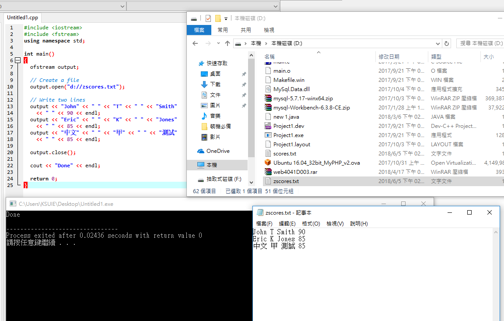
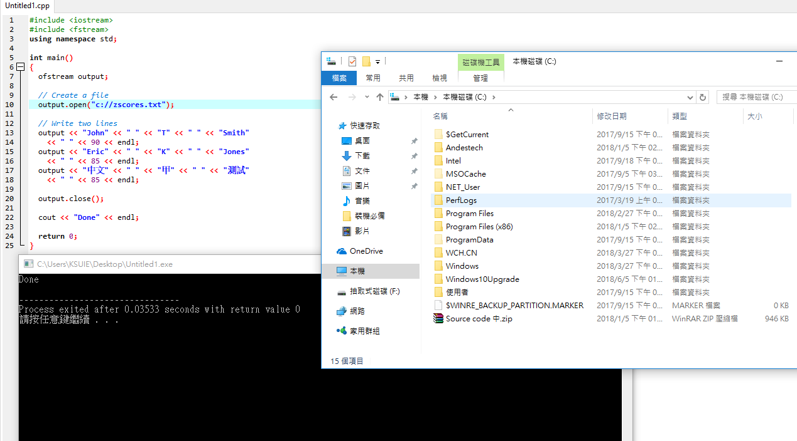
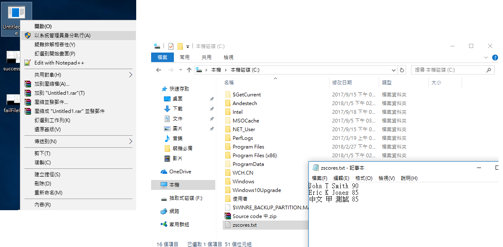
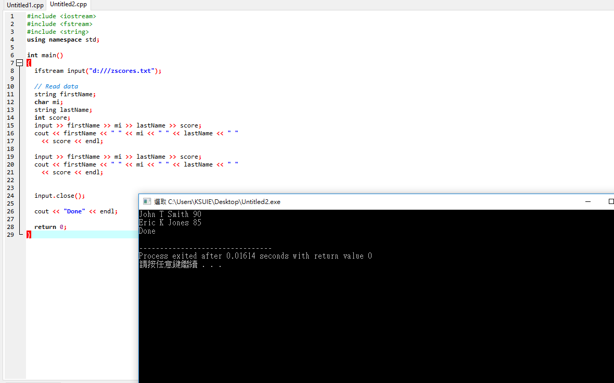
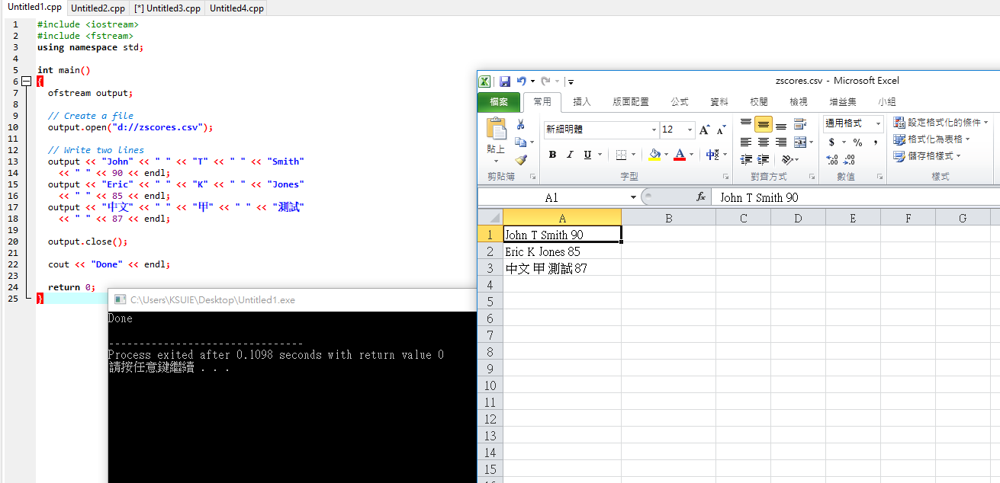
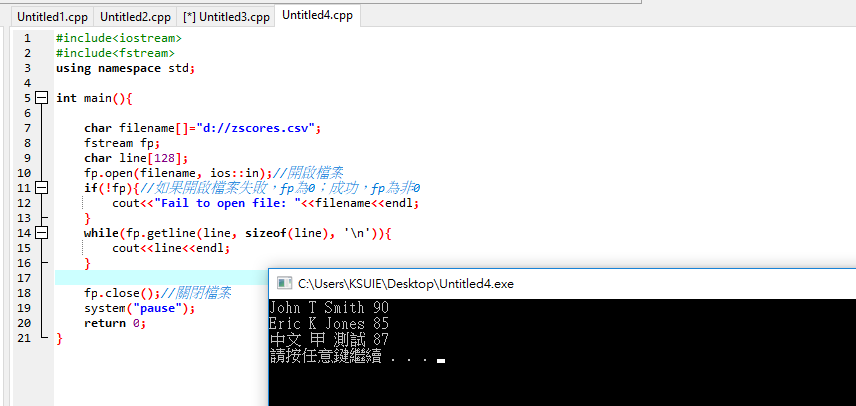
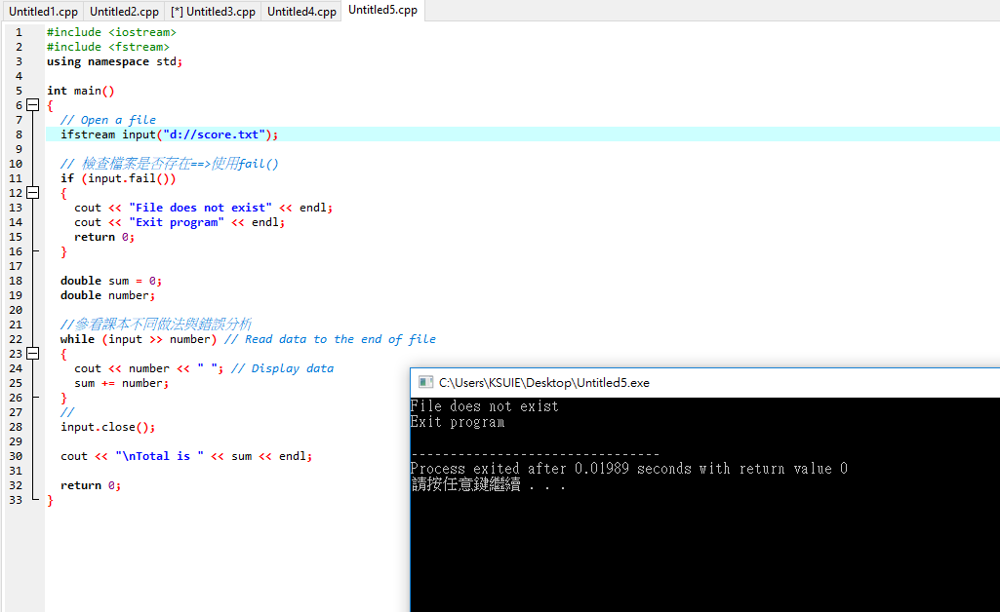
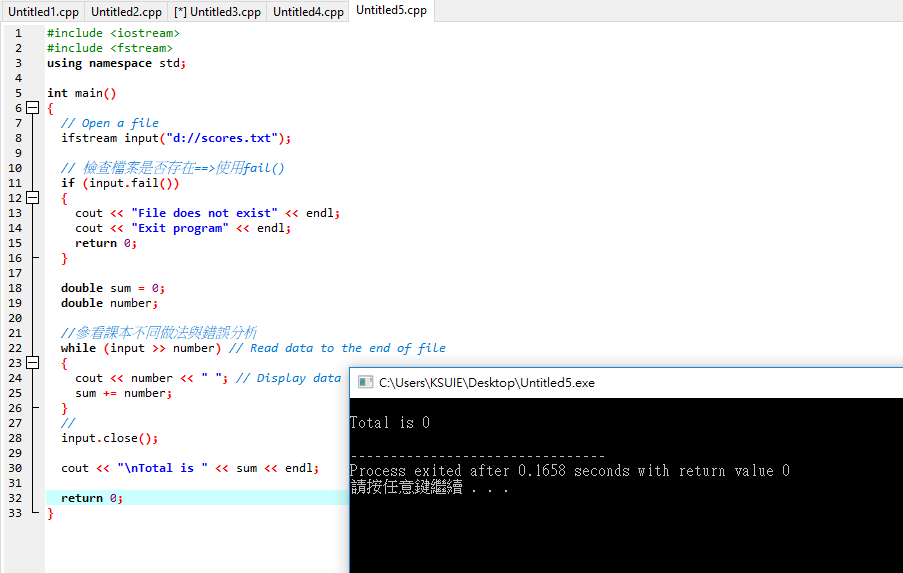

>* 使用 ofstream 將資料寫入於檔案
>* 使用 ifstream 從檔案讀取資料
>* 使用 fstream 建立輸入與輸出串流。
>* 若程式在輸入與輸出需要使用相同的串流物件，則使用 fstream 較為方便。
>* 打開 fstream 檔案，必須指定檔案開啟模式(file open mode)，以告訴 C++ 編譯器檔案是如何使用的。

### 13.2.1把資料寫到檔案
```
#include <iostream>
#include <fstream>
using namespace std;

int main()
{
  ofstream output;

  // Create a file
  output.open("scores.txt");

  // Write two lines
  output << "John" << " " << "T" << " " << "Smith" 
    << " " << 90 << endl;
  output << "Eric" << " " << "K" << " " << "Jones" 
    << " " << 85 << endl;

  output.close();

  cout << "Done" << endl;

  return 0;
}
```

成功存進D槽



因權限不足存進C槽失敗
successFileIO_D.png



以使用者權限執行執行檔成功存進C槽
successFileIO_D.png



### 13.2.2從檔案裡讀出資料
```
#include <iostream>
#include <fstream>
#include <string>
using namespace std;

int main()
{
  ifstream input("scores.txt");

  // Read data
  string firstName;
  char mi;
  string lastName;
  int score;
  input >> firstName >> mi >> lastName >> score;
  cout << firstName << " " << mi << " " << lastName << " "
    << score << endl;

  input >> firstName >> mi >> lastName >> score;
  cout << firstName << " " << mi << " " << lastName << " "
    << score << endl;

  input.close();

  cout << "Done" << endl;

  return 0;
}

```



### 寫進csv資料
```
#include <iostream>
#include <fstream>
using namespace std;

int main()
{
  ofstream output;

  // Create a file
  output.open("d://zscores.csv");

  // Write two lines
  output << "John" << " " << "T" << " " << "Smith" 
    << " " << 90 << endl;
  output << "Eric" << " " << "K" << " " << "Jones" 
    << " " << 85 << endl;
  output << "中文" << " " << "甲" << " " << "測試" 
    << " " << 87 << endl;

  output.close();

  cout << "Done" << endl;

  return 0;
}

```


### 讀取csv資料
```
#include<iostream>
#include<fstream>
using namespace std;
 
int main(){
  
    char filename[]="d://zscores.csv";
    fstream fp;
    char line[128];
    fp.open(filename, ios::in);//開啟檔案
    if(!fp){//如果開啟檔案失敗，fp為0；成功，fp為非0
        cout<<"Fail to open file: "<<filename<<endl;
    }
    while(fp.getline(line, sizeof(line), '\n')){
        cout<<line<<endl;
    }
 
    fp.close();//關閉檔案
    system("pause");
    return 0;
}

```



### 13.2.3 檢查檔案是否存在==>使用fail()
```
#include <iostream>
#include <fstream>
using namespace std;

int main()
{
  // Open a file
  ifstream input("score.txt");
  
  // 檢查檔案是否存在==>使用fail()
  if (input.fail())
  {
    cout << "File does not exist" << endl;
    cout << "Exit program" << endl;
    return 0;
  }

  double sum = 0;
  double number;
  
  //參看課本不同做法與錯誤分析
  while (input >> number) // Read data to the end of file
  {
    cout << number << " "; // Display data
    sum += number;
  }
  //
  input.close();

  cout << "\nTotal is " << sum << endl;

  return 0;
}
```

檔案不存在


檔案存在

